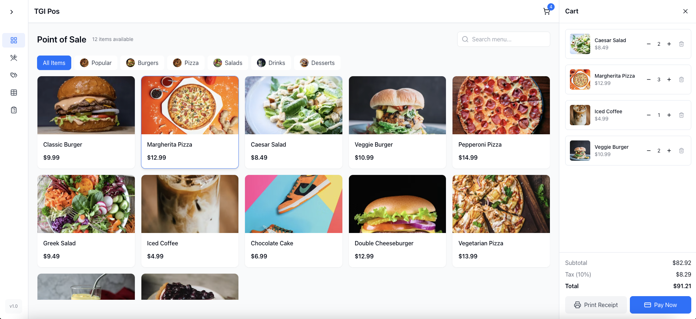

# TGI POS

TGI POS is a desktop point-of-sale application built using Electron, Vite, React, and TailwindCSS. This project offers a fast and responsive offline sales system designed for businesses that require robust local transaction processing alongside modern frontend technologies.

[Demo App](https://tgipos.netlify.app)
> **Note** : Performance may be very slow when using this online mode. TGI POS is specifically designed for offline use.




---

## Features

- **Cross-Platform Desktop App:** Built with Electron to work on major operating systems.
- **Fast Development:** Leveraging Vite for speedy development and hot module replacement.
- **Modern UI:** Using React with TailwindCSS for a clean, responsive interface.
- **Future Enhancements:** Continuously evolving with new features planned!

---

## Road Map

- [x] **Integrate with backend headless CMS** Integrate with Cockpit headless CMS to handle data management and synchronization.
- [x] **POSTMAN API Doc:** Create API documentation using Postman.
- [ ] **Add Authentication:** Implement multi-user login system with role-based access.
- [ ] **Add Reports:** Generate sales, inventory, and performance reports.
- [ ] **Add Refund:** Implement refund functionality to handle returns.
- [ ] **Add Printers and Printing Settings:** Enable support for various printers and customize printing configurations.

---

## Tech Stacks

- **Electron:** Create cross-platform desktop applications with web technologies.
- **Vite:** A modern build tool that significantly improves the development experience.
- **React:** A popular library for building user interfaces.
- **TailwindCSS:** Utility-first CSS framework for rapid styling.

---

## Installation

1. **Clone the Repository:**

   ```bash
   git clone https://github.com/augusthost/tgipos.git
   cd tgipos
   ```

2. **Install Dependencies:**

   ```bash
   npm install
   ```

3. **Run the Application:**

   ```bash
   npm run dev
   ```

   This command starts the Vite development server and launches the Electron app.

---

## Contribution Guide

We truly appreciate your interest in contributing to TGI POS! To ensure smooth collaboration, please follow these guidelines:

1. Branching and Pull Requests:
   - All pull requests must be made to the develop branch.
   - Create a new branch from develop for every feature or bugfix you work on.
   - Once complete, open a pull request targeting the develop branch.
2. Commit Messages:
   - Follow the commit message guidelines as described in the Conventional Changelog/commitlint guide.
   - Your commit messages should be clear, descriptive, and follow the proper format (e.g., type(scope): description).
3. Code Quality and Linting:
   - Ensure that your code passes all ESLint checks before submitting a pull request.
   - PRs that do not pass ESLint will not be merged until all issues are resolved.
   - Run linting locally with the command:
   ```bash
      npm run lint
   ```
   and fix any issues that arise.
5. General Guidelines:
   - Feel free to open an issue to discuss larger changes or new feature ideas before starting work.
   - Follow the existing code style and project structure.
   - Make sure to update documentation as needed when adding new features or modifying existing ones.
   
We welcome your contributions and are excited to build a reliable, offline-capable point-of-sale system together!

---

## Contributors

We welcome contributions! Feel free to check our [contributing guidelines](CONTRIBUTING.md) and submit issues or pull requests. Special thanks to all contributors who have already supported this project.

- [Ronald Aug](https://github.com/ronaldaug)

---

## Star Us on GitHub

If you like TGI Offline POS and want to support our work, please give us a star on GitHub! Your support means a lot and helps us increase the reach of this project.

[](https://github.com/augusthost/tgipos/stargazers)

---

## Donate Us on [Buy Me a Coffee](http://buymeacoffee.com/ronaldaug)

If you find TGI Offline POS helpful, consider supporting the project by buying us a coffee. Your generosity helps us continue to improve and develop new features!

---

## Inspiration

The idea for TGI Offline POS was born out of the need for a reliable, offline-capable point-of-sale system that doesn't rely on constant internet connectivity. We wanted to combine the best of modern web technologies with the stability of a desktop application to create a comprehensive solution for retail and service businesses.

---

## Acknowledgements

- Thanks to the developers and maintainers of [Electron](https://www.electronjs.org/), [Vite](https://vitejs.dev/), [React](https://reactjs.org/), and [TailwindCSS](https://tailwindcss.com/) for their amazing work.
- Special thanks to the open-source community for continuous support and contributions.

---

Feel free to open issues, suggest new features, or contribute code. Let's build a powerful offline POS system together!
